<!--
 - SPDX-FileCopyrightText: 2026 Nextcloud GmbH and Nextcloud contributors
 - SPDX-License-Identifier: AGPL-3.0-or-later
-->
# Recruiting

**Your whole hiring funnel inside Nextcloud — private, automated where it's
boring, human where it matters.**

Applications arrive by email and become candidates on a pipeline board by
themselves. The hiring team screens with unbiased votes, interviews are booked
against real calendars with the candidate picking a slot on a public page, and
offers run through a proper four-eyes approval before they go out. Rejections,
retention, anonymization — the compliance chores run on autopilot. Everything
stays on your own server; nothing about your candidates is ever replicated to
a third party.

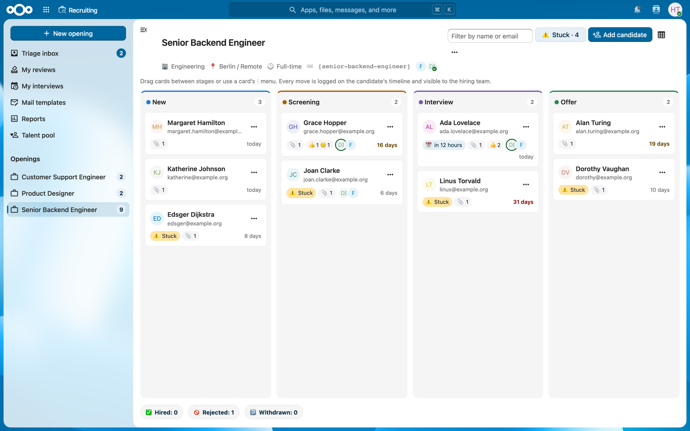

## Why it's cool

* 📥 **Zero-touch intake** — a mail to `jobs+backend-engineer@…` becomes a
  candidate card with CV attached, an AI summary, and an automatic
  confirmation to the applicant. When the candidate *replies* to any of your
  mails, the answer (attachments included) lands on their timeline — not in
  the inbox as a duplicate application. Nobody copies data around, ever.
* 🗳️ **Unbiased screening** — screeners vote 👍/🤔/👎 with a comment, and
  nobody sees the other votes until they cast their own. A "no" always needs
  a written reason.
* 📅 **Self-scheduling interviews** — the app reads the interviewers'
  calendars, proposes free slots, and the candidate picks one on a public
  page in their own timezone. Calendar event, invitations and (with Talk) the
  video room appear by themselves.
* 🤝 **Offers with four eyes** — salary data is invisible to interviewers,
  every offer needs a designated approver (never yourself), and expiring
  offers warn you three days ahead.
* 🔒 **GDPR on autopilot** — documents live in app storage (never in Files),
  rejected candidates are anonymized automatically after the retention
  period, exports for data-access requests are one click, and the talent pool
  is strictly consent-based.
* 🪄 **AI where it removes busywork** (optional, via Nextcloud Assistant) —
  summaries, screening hints, mail drafts, interview questions. Always
  labeled, always human-reviewed, never a decision.
* 🚦 **A board that thinks along** — stuck candidates get a ⚠️ chip and a
  one-click filter (no votes? no interview booked? offer expiring?), the
  time-in-stage turns amber and then red as people wait, and the screener
  avatars on each card show who has voted — never what.
* 📊 **Honest reporting** — funnel, time-in-stage and time-to-hire are
  reconstructed from what actually happened, and keep working even after
  anonymization.
* 📖 **A real handbook** — a beautifully typeset PDF for non-technical HR
  people, linked right in the app's navigation.

| Screening without anchoring | The candidate picks their own slot |
|---|---|
| 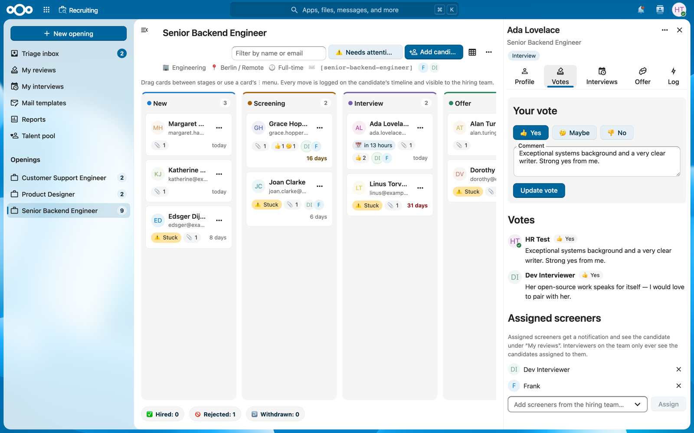 | 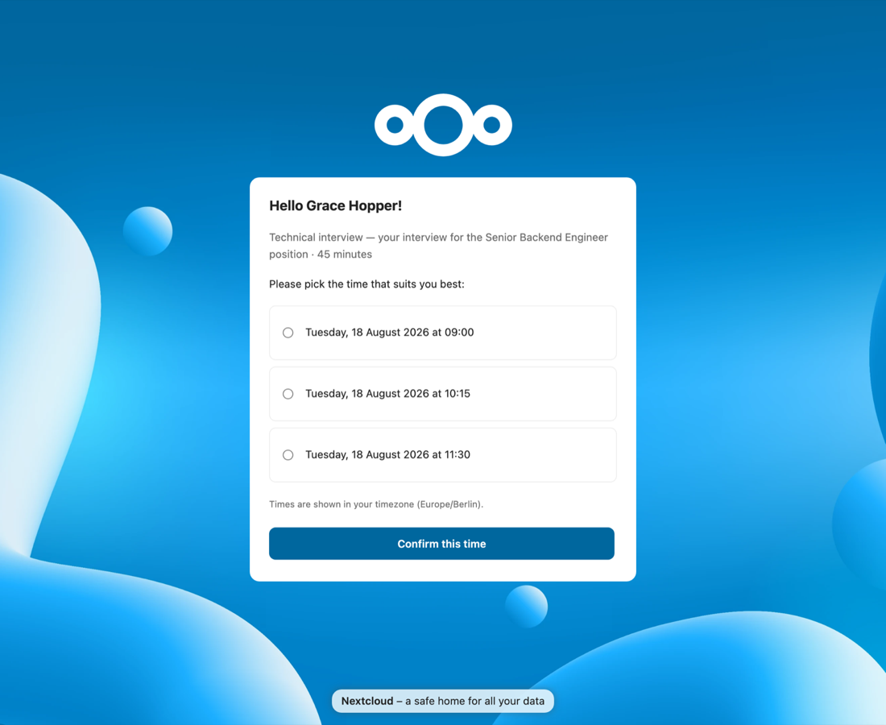 |

## The handbook

The **user handbook** — a beautiful PDF for HR people and hiring managers with
no technical background — is linked at the bottom of the app navigation
("Handbook (PDF)"). Its source lives in [docs/handbook.html](docs/handbook.html);
`make handbook` re-renders the PDF via headless Chrome after UI changes.

## The people model

There is no second org chart. **Recruiters** are the members of one Nextcloud
group (default `recruiting`) and can do everything. Per opening you pick a
hiring team: **hiring managers** run the process for that opening,
**interviewers** only ever see the candidates assigned to them (and never any
salary data), **observers** may watch but not act. Being a Nextcloud admin
grants no candidate access at all.

## How it works — screen by screen

### Navigation (left sidebar)

| Entry | Who sees it | What it is |
|---|---|---|
| **New opening** | recruiters | Creates a job opening (see below) |
| **Triage inbox** | recruiters | Mail applications that matched no opening; the counter shows how many wait |
| **My reviews** | everyone | Candidates you were asked to screen — badge shows whether you still owe a vote |
| **My interviews** | everyone | Your interview panel appointments, incl. "pending" ones the candidate hasn't confirmed yet |
| **Mail templates** | recruiters | Manage the invitation/rejection/offer/confirmation mail templates |
| **Reports** | team members & recruiters | Funnel, time-to-hire, rejection reasons — scoped to what you may see |
| **Talent pool** | recruiters | Candidates who consented to be kept for future openings |
| **Openings** | team members & recruiters | One entry per opening with the count of active candidates; closed openings collapse at the bottom |
| **Handbook (PDF)** | everyone | The illustrated user handbook, at the bottom of the navigation |

### The opening (pipeline board)

The board shows the four active stages — **New → Screening → Interview →
Offer**, each with its own accent color. Column headers show the real totals;
busy stages load 100 cards and offer **Show more**. The filter box narrows the
loaded cards by name or email, and the **⚠️ Stuck** filter shows only
candidates where something needs attention — waiting in "New" for a week, no
votes yet, no interview booked, no active offer, or an offer about to expire
(hover a card's ⚠️ chip to see the reasons). Cards show the assigned screeners (a green ring =
has voted) and the time-in-stage turns amber, then red, as a candidate ages.
Drag a card to move a candidate (or use the card's ⋮ menu — fully
keyboard-accessible); every move is logged on the candidate's timeline and in
the Activity stream. **Hired / Rejected / Withdrawn** are shown as summary
chips below; click one to switch to the table view where all candidates,
including finished ones, are listed.

The same candidates as a sortable table (click a column header) — including
everyone who is already hired, rejected or withdrawn. Managers can select
several candidates and move or reject them in bulk; the rejection mail preview
still appears per candidate, so nothing goes out unreviewed:

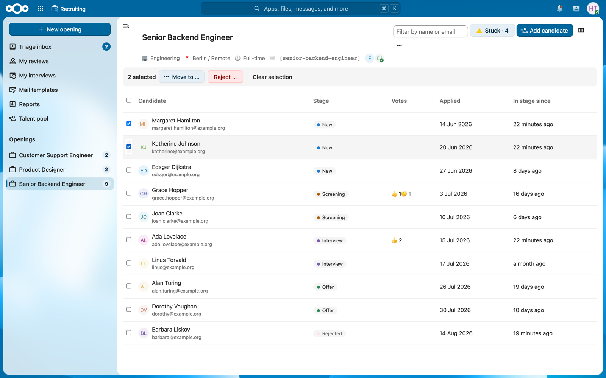

Header actions (managers and recruiters):

* **Add candidate** — manual entry with drag-and-drop CV upload. The candidate
  starts in "New" and the hiring managers are notified.
* **Board/table toggle** — same data, two views.
* **💬 Team chat / Create team chat** — one click creates a Talk conversation
  with the current hiring team. (Talk's API fixes the member list at creation,
  so if the team changes, delete and recreate the room.)
* **⋮ → Edit opening & team** — title, description, requirements (these feed
  the AI features), the auto-confirmation toggle, and the hiring team with
  roles.
* **⋮ → Put on hold / Reopen / Close** — closing warns you if candidates are
  still active; they keep their stage and can still be rejected (with mail)
  afterwards.

The header also shows the opening's **mail tag** (e.g.
`[backend-engineer]`): applications sent to `jobs+backend-engineer@…` or with
the tag in the subject skip triage and land directly on this board.

### The candidate (detail sidebar)

Click any card and the sidebar opens with five tabs:

* **Profile** — contact details (editable by managers), source, an optional
  AI summary (labeled, regenerable), duplicate warning with a link to the
  earlier application, and — in triage — the "Assign to opening" control.
  At the bottom, **Documents**: CVs and attachments, previewable in the
  browser. Stored in app storage: never visible in Files, never accessible to
  people without access to this candidate.

  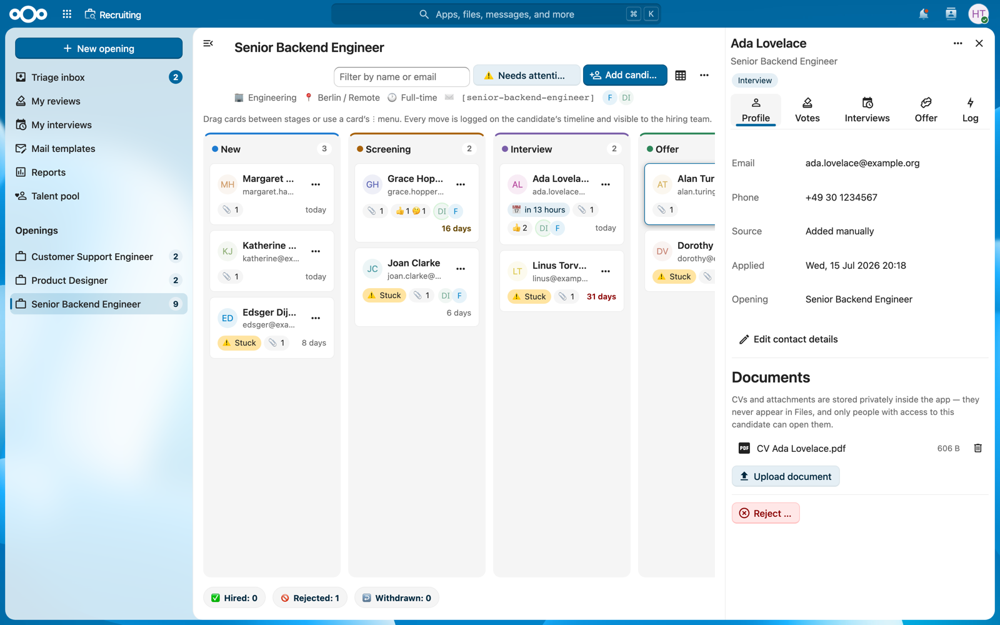
  

* **Votes** — cast or update your vote (👍/🤔/👎 + comment; a "no"
  requires a reason). Votes of others stay hidden until you've voted.
  Managers assign screeners here — each assignee is notified and gets the
  candidate in "My reviews". Optional AI screening hint against the opening's
  requirements ("verify yourself — the humans decide").

  

* **Interviews** — every round with its status. *Awaiting candidate* means the
  public link is out; copy it from here if you want to resend it yourself.
  Cancelling notifies all interviewers and cancels the calendar event.
  Optional AI interview-question suggestions.

  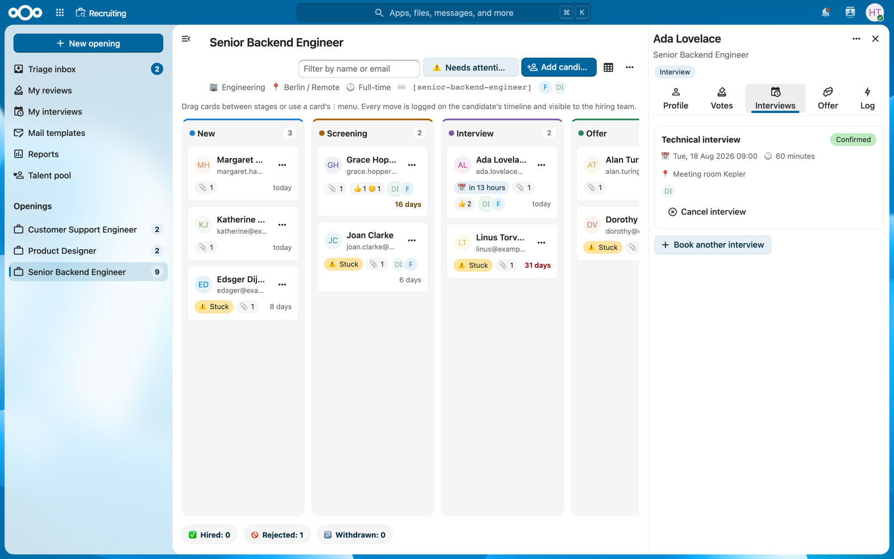

* **Offer** — visible only to recruiters, this opening's managers and the
  offer's approver. The whole offer lifecycle happens here (see below).

  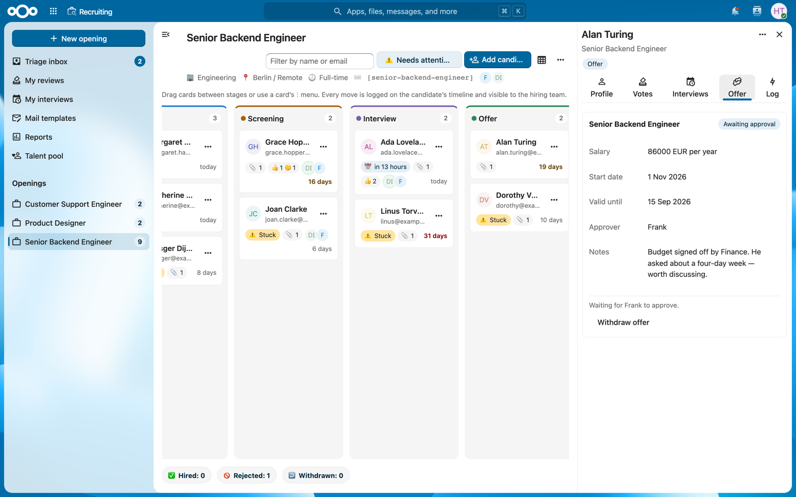

* **Log** — the complete timeline (every stage move, mail with full text,
  vote, interview, offer step) merged with the team discussion thread.
  Candidate replies appear here too ("The candidate replied: …").
  @-mention a teammate to notify them.

  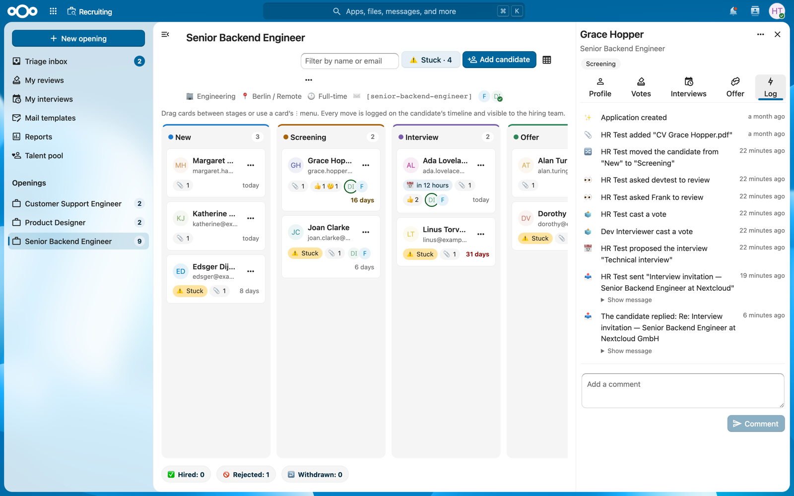

**Reject …** is the red button at the bottom of the profile tab. The header
menu carries **Book interview**, **Move to …**, and for
recruiters **Export data (GDPR)** (ZIP with everything about this person —
without reviewer identities) and **Delete permanently (GDPR)** (removes the
candidate with all documents, votes, comments, interviews and notifications —
irreversible, confirmation required).

### Booking an interview

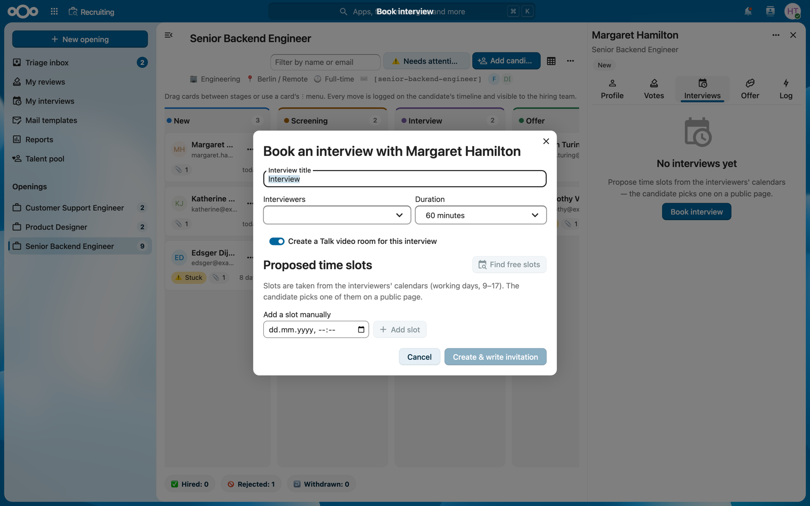

1. Pick interviewers and duration; choose whether a **Talk video room**
   should be created (if Talk is installed) — turned off, you can note a
   location or a video link from another tool instead.
2. **Find free slots** reads the interviewers' calendars (working days,
   9–17) and proposes times; deselect any, or add slots manually.
3. **Create & write invitation** creates the interview and prefills the
   invitation mail including the personal scheduling link. Edit freely — if
   the link gets lost, the app re-attaches it. Send, or copy the link and
   deliver it yourself.
4. The candidate opens the public page (times shown in *their* timezone,
   no account needed) and confirms one slot. That books the calendar event
   with all interviewers invited, creates the Talk room for video interviews,
   moves the card to "Interview", and notifies the panel. The confirmation
   page offers the appointment as an .ics download for the candidate's own
   calendar.

| Picking a slot — no account required | After confirming: details + calendar file |
|---|---|
|  | 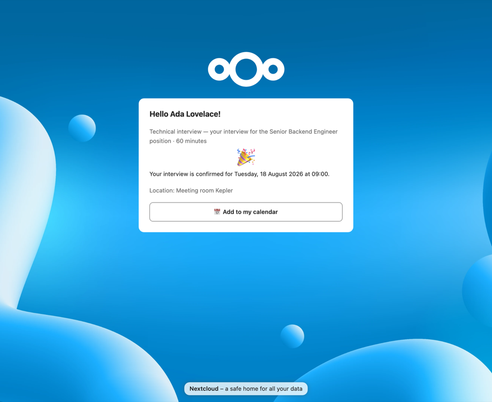 |

### Rejecting

**Reject …** asks for an internal reason (feeds the reports), shows the
rejection mail prefilled from your template for review — nothing ever goes
out unreviewed — and optionally adds the **talent-pool consent link**. If
sending fails, the candidate is *not* marked rejected; nobody ends up
silently rejected-but-uninformed. Rejecting without an email is possible for
candidates without an address.

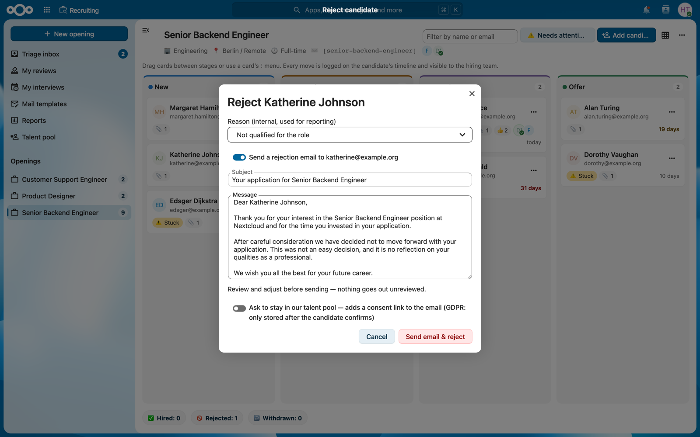

### The offer lifecycle

1. **Draft** — job title, salary (amount/currency/period), start date,
   validity date, internal notes. Editable only while a draft.
2. **Request approval** — pick any Nextcloud user as approver (never
   yourself). They're notified and get scoped access to exactly this
   candidate and offer; they **approve** or **send back to draft** with a
   note.
3. **Send** — only approved offers can go out: review the offer mail and send
   it, or "mark as sent" if it went out another way. The card moves to
   "Offer" and the validity clock starts.
4. **Track the response** — *Accepted* moves the candidate to "Hired" 🎉 (and
   reminds you to close the opening); *Negotiating* and *Declined* are
   recorded. Offers past their validity date expire automatically; the
   creator is warned three days ahead.
5. **Withdraw** is possible at any point before a final answer.

### Triage inbox

Mail applications that matched no opening. Open one and assign it to an
opening in its profile tab (moves it into that board's "New" column and
notifies the managers), or delete spam permanently from the row's ⋮ menu.
A heartbeat line shows when the mailbox was last checked — and warns when
the last check failed. Pro tip: put the mail tag into your job postings and triage stays
empty.

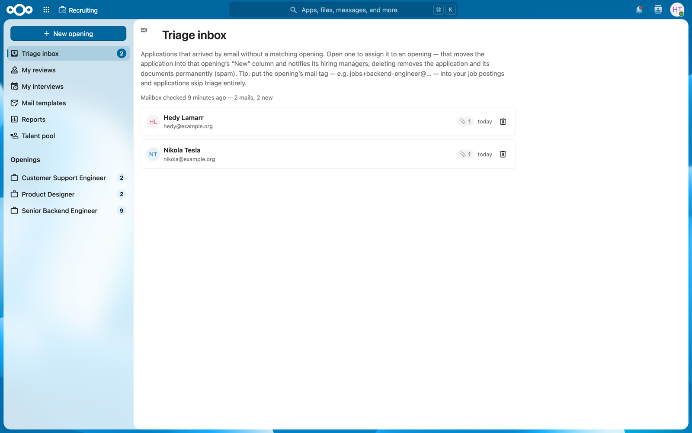

### My reviews & My interviews

The two personal to-do lists: what you still owe a vote on, and where you are
on the interview panel. "My reviews" sorts candidates you have not voted on to
the top; "My interviews" also shows rounds the candidate has not confirmed yet.

| My reviews | My interviews |
|---|---|
| 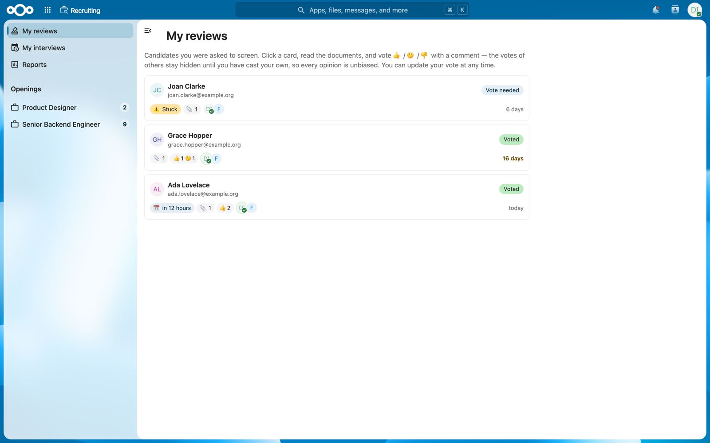 | 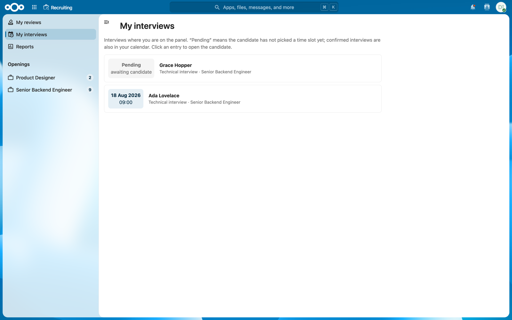 |

### Talent pool

Only candidates who clicked the consent link from their rejection mail appear
here — consent is never assumed. **Add to opening** creates a fresh copy
(documents included) in the target opening's "New" column; the pool entry
stays for further openings. Membership expires automatically after the
configured period, after which the candidate is anonymized like everyone
else.

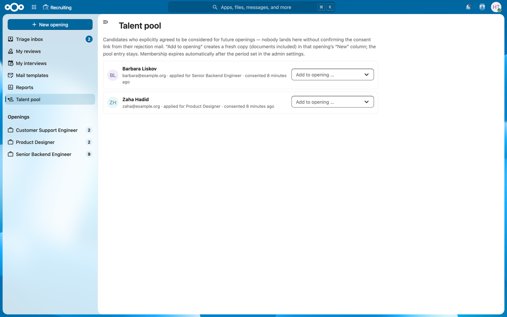

### Reports

Headline tiles (candidates, hired, average days to hire, open offers), an
applications-per-week chart, and per opening: the funnel with average
time-in-stage, open offers, and the rejection-reason breakdown. All numbers
are reconstructed from each candidate's actual history and survive
anonymization. You only see openings you have access to.

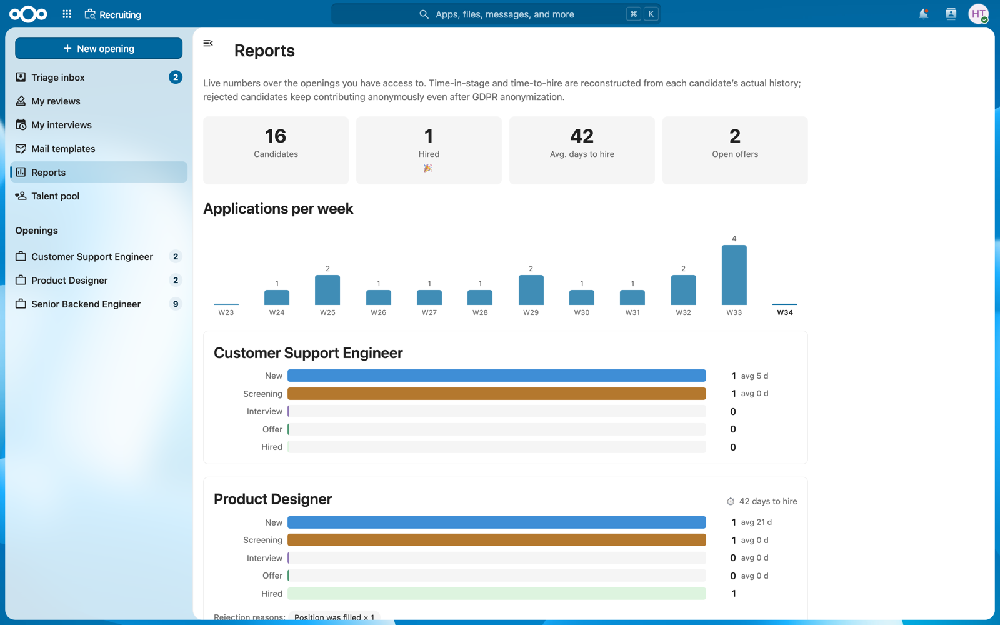

### Mail templates

Per mail type (confirmation of receipt, interview invitation, rejection,
offer) the built-in template is always available; **Customize** copies it into
an editable one and **Make default** activates it. The editor offers each
type's placeholders as chips — click to insert — and validates them when you
save, so typos can't reach a candidate. Every send shows a
resolved preview first, and every sent mail lands on the candidate's timeline.

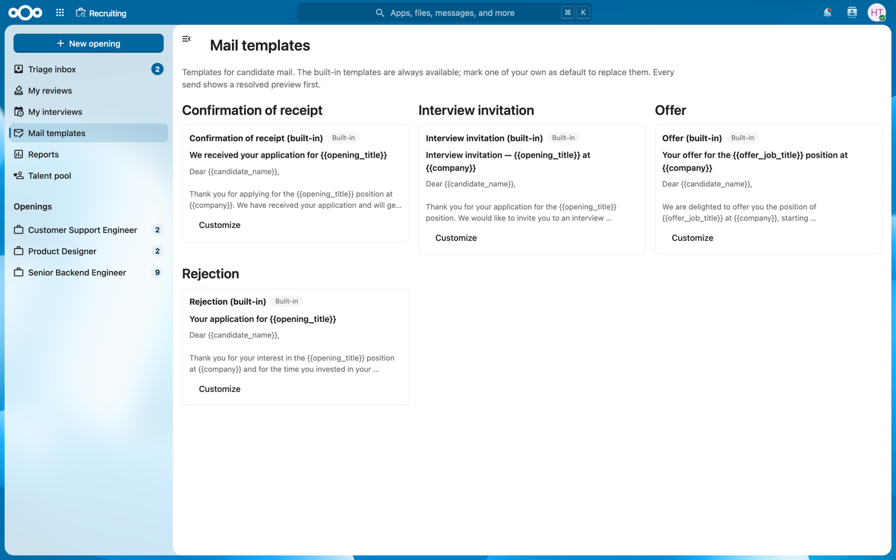

### Settings

**Administration → Recruiting** (admins): the HR group, the sender identity
for candidate mail, the application mailbox (IMAP host/user/password with a
*Test connection* button; fetched every 5 minutes), the GDPR retention period
(0 disables the automation) and the talent-pool membership duration.

**Personal settings → Groupware** (everyone): the **email digest** — off,
daily or weekly. It bundles new applications in your openings, your pending
reviews, your upcoming interviews and offers awaiting your approval, and is
only sent when there is something to report.

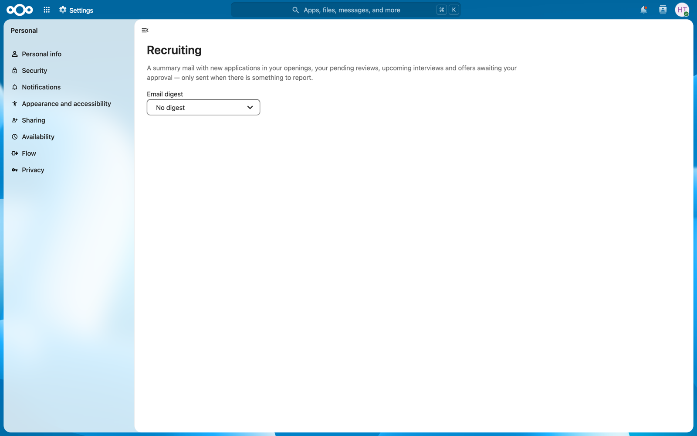

### Fully integrated

Bell notifications for everything that concerns you (assignments, interview
confirmations, candidate replies, offer approvals, @-mentions, expiring
offers), Activity stream entries per candidate, unified search over candidates
and openings (permission-scoped), and deep links from every notification
straight to the right candidate. The interface ships in English and German.

## Setup

1. Enable the app: `occ app:enable recruiting`.
2. In **Administration settings → Recruiting**: pick the HR group, set the
   sender identity, configure the application mailbox and enable fetching.
3. Create your first opening, add the hiring team — done.

Interview scheduling uses the interviewers' Nextcloud calendars. Optional
integrations light up automatically when available: **Talk** (video interview
rooms, team chats) and **Nextcloud Assistant** with an AI provider (summaries,
hints, drafts). Without them, the corresponding buttons simply don't appear.

## occ commands

| Command | Purpose |
|---|---|
| `recruiting:fetch-mail` | Fetch the applications mailbox now |
| `recruiting:retention:run [--dry-run]` | Anonymize candidates whose retention period is over |

## Development

```bash
npm ci && npm run build   # frontend (Vue 3 + @nextcloud/vue 9, Vite)
```

Backend unit tests live in `tests/Unit` (plain PHPUnit, no server bootstrap
required). The complete behaviour, data model, permission matrix and design
decisions are documented in the [specification](Recruiting-SPEC.md); §10 of the
spec records how the implementation turned out, including the confidentiality
rules the code enforces and the known deviations.
